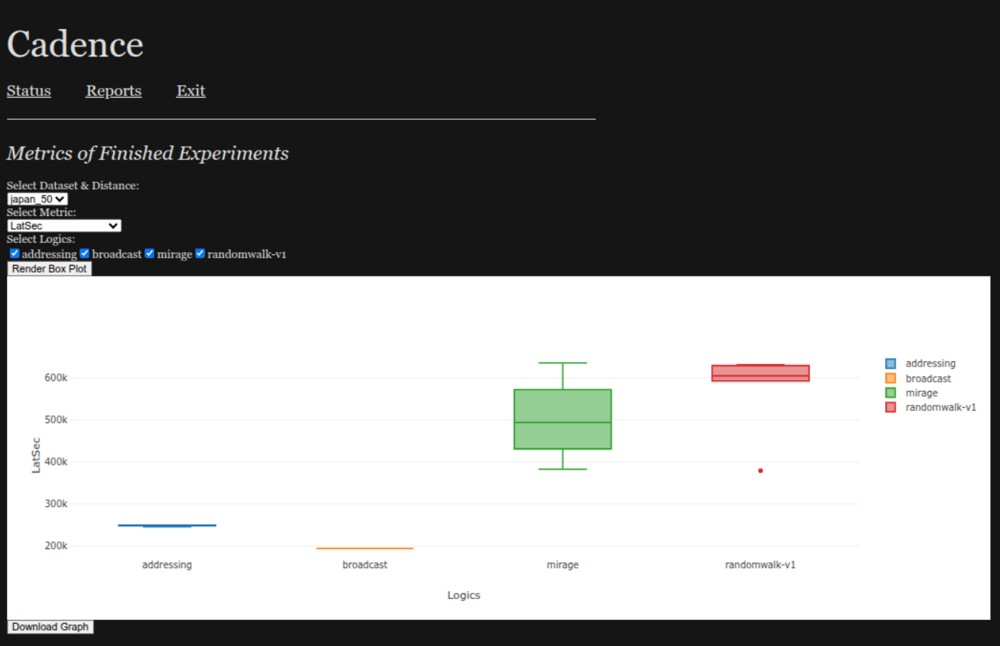

# The Cadence simulator

**to reproduce NDSS 2026 results, see [NDSS_README.md](NDSS_README.md).**

Authors: Ruoxing Yang, Harel Berger, Micah Sherr, Adam Aviv

## Components

The major components of Cadence are:

* The Cadence simulator
* The backend database (currently mysql and sqlite3 are supported, with mysql
  being the recommended backend).
* A number of human mobility datasets. 

## Usage

Cadence can either be run manually or with python automation scripts. To run Cadence manually, follow the steps listed below in this document. To run Cadence using automation scripts (recommended), refer to the NDSS-specific documentation [NDSS_README.md](NDSS_README.md).

## Getting ready to use Cadence

Follow these steps to obtain and compile cadence. 

### Prerequisites

* Install Go.

* Install [git-lfs](https://git-lfs.com/).

### Obtaining and compiling

To compile, do:

```
cd cmd/cadence  # or marathon-sim/cmd/cadence depending on where you are
go build
```

You should now have a program, `cadence`.  Tada!


## Running Cadence

Cadence imports data using a command line interface and displays as a web application. Configuration parameters are conveyed in the form of a json file.

**For details on configuration, please consult [CONFILES.md](docs/CONFILES.md).**

**For specific instructions on Mirage experiments, see [MIRAGE_INSTRUCTIONS.md](MIRAGE_INSTRUCTIONS.md).**

Cadence has four modes of operation. For each, replace config_file_path with the correct path to the json config file.

1. web - runs a web application that outputs experiment results

```
./cadence web config_file_path
```

2. sim - runs a simulation experiment on the dataset and lens

```
./cadence sim config_file_path
```

3. import - imports a new dataset

```
./cadence import config_file_path
```

4. list - lists lenses

```
./cadence list config_file_path
```

5. report - generate pdf report for the experiments
```
./cadence report config_file_path
```

If no configuration file is passed in, cadence will run using the default configuration. 

  
### Importing a human mobility dataset

The `cadence import` command is used to import an external human movement
dataset into the database backend.  This should be done exactly once per
dataset.  Since Cadence simulations use imported human mobility data (as opposed
to opening external files), you must import the data before running simulations
on it. To run the import, you should fill the correct parameters in the TopLevel and cli parts of the general config file.

In Cadence parlance, a *lens* is a module (see [/pkg/lens](/pkg/lens)) that
imports a human mobility dataset.  Each dataset format uses a different lens.
There's a 1:1 mapping between the two.  (Consequently, supporting additional
dataset formats requires adding a new lens to Cadence.)

You can list the currently supported lenses via `./cadence list`.  This
currently yields:

```
tdrive
japan
```

### Running a simulation

Before running a simulation, you need to import the human mobility dataset on which you'd like to run a HumaNet routing protocol.  (See above.)  This import needs to happen just once per dataset.

Cadence simulations are run using the `sim` option to Cadence.  `cadence sim config_file.json` 
The full command is passed by a JSON config file, so one should not need to write the full command manually. 

For more information on simulations, visit [OVERVIEW.md](docs/OVERVIEW.md).

## Graphing

When run with the `./cadence web config_file.json` command, Cadence runs a web server which is able to run reports and generate graphs. The top level and web parts of the general config file are used to utilize the web server.

Pointing your web browser at the specified host and port (by default [http://localhost:8080](http://localhost:8080)), will yield the Cadence web interface.


Cadence can provide some basic status information by clicking the "Status" link at the top of the page:


Cadence offers a number of reports that can be run.  These can be found by clicking the "Reports" link at the top of the page:


Currently implemented reports include listing number of events of each node...


...and a report that lists the number of encounters per node:


... and an interactive box & whiskers graph on different metrics (only on finished experiments), such as throughput, network load, latency, etc.



## Other Documentation

For more information on Cadence, see further documentation in the /docs directory:

* Configuration - [CONFILES.md](docs/CONFILES.md).
* Logic API Interface - [LOGICAPI.md](docs/LOGICAPI.md).
* Routing Logics - [LOGICS.md](docs/LOGICS.md).
* Simulation Overview - [OVERVIEW.md](docs/OVERVIEW.md).
* Memory Profiling - [PROFILING.md](docs/PROFILING.md).
* Messages - [MESSAGES.md](docs/MESSAGES.md).

## Glossary

* **experiment**: an execution of a simulation

* **encounter**: an event in which two nodes meet the necessary criteria (i.e., encounter conditions) to exchange messages

* **encounter condition**: a predicate that determines whether two nodes at a given moment in time are considered to have encountered one another

* **node**: a principal in a human movement dataset.  Nodes represent smartphones participating in the MARATHON system.

* **nodeID**: a unique identifier for a node; an integer.

## Reference Paper: 

```bibtex
@inproceedings{berger2023cadence,
  title={Cadence: A Simulator for Human Movement-based Communication Protocols},
  author={Berger, Harel and Sherr, Micah and Aviv, Adam},
  booktitle={Proceedings of the 16th Cyber Security Experimentation and Test Workshop},
  pages={26--31},
  year={2023}
}

