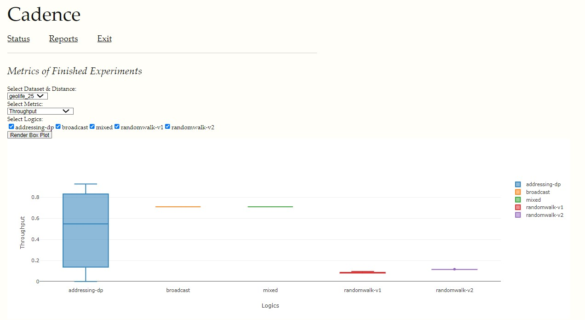

# The Cadence simulator

authors: Ruoxing Yang, Harel Berger, Micah Sherr, Adam Aviv

## Components

The major components of Cadence are:

* The Cadence simulator
* The backend database (currently mysql and sqlite3 are supported, with mysql
  being the recommended backend).
* A number of human mobility datasets.  The datasets are stored in [another
  dedicated git repository](https://github.com/GUSecLab/marathon-mobility-data).
  Note that the mobility datasets git repository contains large files, which are
  stored using [git-lfs](https://git-lfs.com/) -- and hence you'll need to
  install `git lfs` to use Cadence.
* A standalone program for creating random human mobility datasets.  (This may
  no longer be useful.)

Cadence's design is specified in the [Design Document](DESIGN.md).  See also the [Glossary](#glossary), below.


## Getting ready to use Cadence

Obtaining and compiling Cadence is easy.

### Prerequisites

* Install Go.

* Install [git-lfs](https://git-lfs.com/).

### Obtaining and compiling

Do the following:
```
git clone git@github.com:GUSecLab/marathon-sim.git
cd marathon-sim
git submodule init
git pull --recurse-submodules
```

OK, now you *have* everything.  To compile, do:
```
cd cmd/cadence  # or marathon-sim/cmd/cadence depending on where you are
go build
```

You should now have a program, `cadence`.  Tada!


## Running Cadence

Cadence runs as both a web service and a command-line application. 
Each mode is run using a config file called "General conf file". For details, please consult [CONFILES.md](docs/CONFILES.md).
  
  
### Importing a human mobility dataset

The `cadence cli import` command is used to import an external human movement
dataset into the database backend.  This should be done exactly once per
dataset.  Since Cadence simulations use imported human mobility data (as opposed
to opening external files), you must import the data before running simulations
on it. To run the import, you should fill the correct parameters in the TopLevel and cli parts of the "General conf file".

In Cadence parlance, a *lens* is a module (see [/pkg/lens](/pkg/lens)) that
imports a human mobility dataset.  Each dataset format uses a different lens.
There's a 1:1 mapping between the two.  (Consequently, supporting additional
dataset formats requires adding a new lens to Cadence.)

You can list the currently supported lenses via `./cadence cli lenses`.  This
currently yields:
```
randomWalk
geolife
```
You probably want to use the geolife dataset, which is [described here](https://www.microsoft.com/en-us/research/publication/geolife-gps-trajectory-dataset-user-guide/).  Note that the datasets are available in the 
[marathon-mobility-data submodule](https://github.com/GUSecLab/marathon-mobility-data).


### Running a simulation

Before running a simulation, you need to import the human mobility dataset on which you'd like to run a HumaNet routing protocol.  (See above.)  This import needs to happen just once
per dataset.

Cadence simulations are run using the `sim` option to Cadence.  `cadence conf_file sim` 
The full command is passed by a JSON config file, so one should not need to write the full command manualy. 

## Graphing

When run with the `./cadence config_file web` command, Cadence runs a web server which is able to run reports and generate graphs. The top level and web parts of the "General conf file" are used to utilize the web server.

Pointing your web browser at the specified host and port (by default [http://localhost:8080](http://localhost:8080)), will yield the Cadence web interface.


Cadence can provide some basic status information by clicking the "Status" link at the top of the page:


Cadence offers a number of reports that can be run.  These can be found by clicking the "Reports" link at the top of the page:


Currently implemented reports include listing the active periods ("timespans") of each node...


... a report that lists the number of encounters per node...


... and an interactive box & whiskers graph on different metrics (only on finished experiments), such as throughput, network load, latency, etc.



## Glossary

* **experiment**: an execution of a simulation

* **encounter**: an event in which two nodes meet the necessary criteria (i.e., encounter conditions) to exchange messages

* **encounter condition**: a predicate that determines whether two nodes at a given moment in time are considered to have encountered one another

* **node**: a principal in a human movement dataset.  Nodes represent smartphones participating in the MARATHON system.

* **nodeID**: a unique identifier for a node; an integer.


## Reference Paper: 

```bibtex
@inproceedings{berger2023cadence,
  title={Cadence: A Simulator for Human Movement-based Communication Protocols},
  author={Berger, Harel and Sherr, Micah and Aviv, Adam},
  booktitle={Proceedings of the 16th Cyber Security Experimentation and Test Workshop},
  pages={26--31},
  year={2023}
}
